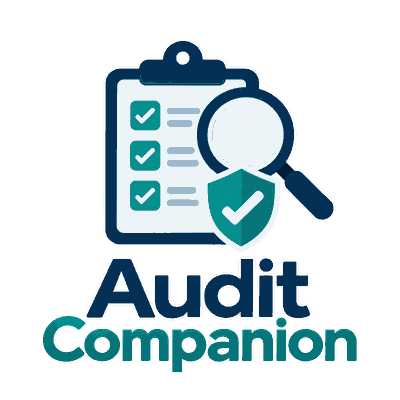

<p align="center">
  
</p>

<h1 align="center">Audit Companion</h1>

<p align="center"><b>A beginner-friendly, centralized internal audit workspace for Testing Validation Lab teams.</b></p>

<p align="center">
  <a href="https://audit-companion-g440ez.v2.appdeploy.ai/"></a>
  <a href="https://github.com/omvnn/audit-companion/actions/workflows/ci.yml"></a>
  
  
</p>

<p align="center">
  
  
  
</p>

Audit Companion keeps **audit plans, audits, evidence, findings, CAPA, analytics and team access in one shared place**. It is designed for Material, Performance and Safety Lab audits and uses Supabase for centralized data and security.

> **Current release:** **v0.3.0 — Audit Plan Import**

## 🚀 Start here

1. **Open the live app:** [Audit Companion](https://audit-companion-g440ez.v2.appdeploy.ai/)
2. **Sign in** with your team account.
3. Select **+ New audit**. Admin and Lead Auditor users are taken to **Import Audit Plan** first; upload a PDF/JPG/PNG or choose **Create manually** as the fallback.
4. Review extracted plan data before selecting **Create Audit**. Unreadable or low-confidence required content is blocked rather than silently guessed.

For the complete handoff, architecture, security posture and verification state, see [`docs/PROJECT_SUMMARY.md`](docs/PROJECT_SUMMARY.md).

## ✨ What it can do

| Capability | What it means |
| --- | --- |
| 📥 Audit plan import | Import PDF/JPG/PNG plans as the default audit-creation workflow. |
| 🔎 Quality-first OCR | Browser-local checks reject blur, crop, glare and other unreadable pages before OCR/parser promotion. |
| 🧩 Deterministic plan rebuild | Extract audit metadata, ISO clauses, inspection items and Document Review / Inquiry / On-site Inspection flags while preserving repeated rows. |
| 📄 Multi-page recovery | Keep good pages and replace only failed pages before final review. |
| ✅ Review-before-create | No operational audit is created until the reviewed staged plan is explicitly promoted. |
| 🧭 ISO 9001 scope picker | Manual fallback can still choose clauses 4–10 and specific subclauses. |
| 🧾 Evidence capture | Record objective evidence, notes, sample references and private file evidence. |
| 🚩 Findings | Record Observation, OFI, Minor NC and Major NC. |
| 🔁 CAPA lifecycle | Track root cause, category, corrective action, owner, due date, verification and closure. |
| 📋 CAPA Register | Consolidated, filterable CAPA table across readable audits. |
| 📊 Per-audit analytics | Completion, conformity, NC, evidence coverage, findings and CAPA metrics. |
| 📈 Management analytics | Audit trends, labs, clauses, process stages, root causes, CAPA aging/workload and recurring signals. |
| 👥 Team roles | Admin, Lead Auditor, Auditor and Viewer with controlled access. |
| 📤 Reporting | Audit CSV, CAPA CSV and Print / PDF reporting. |
| 📱 Responsive UI | Desktop and mobile layouts. |

## 👤 Roles at a glance

| Role | Typical use |
| --- | --- |
| **Admin** | Workspace administration, invites, team roles, all plan imports, global CAPA/analytics and audit management. |
| **Lead Auditor** | Imports/creates audits, manages owned staged imports and uses global CAPA/analytics subject to RLS. |
| **Auditor** | Works on assigned/readable audits and records evidence/findings/CAPA; cannot create staged plan imports. |
| **Viewer** | Read-only access to assigned/readable audits and per-audit analytics; cannot create staged plan imports. |

## 🧠 v0.3.0 import model

```text
PDF / JPG / PNG
      │
      ▼
Local quality checks
      │
      ├── unreadable → reject / replace page
      ▼
Browser-local OCR
      │
      ▼
Deterministic parser
      │
      ▼
Private staged import
      │
      ▼
Human review
      │
      ▼
Atomic promotion RPC
      │
      ├── Audit
      ├── Lead membership
      ├── Exact checklist rows
      └── Source-document lineage
```

AI fallback is intentionally **fail-closed and unconfigured** in v0.3.0. No provider endpoint or provider secret is exposed in the browser.

## 📊 Analytics model

```text
Audits + Responses + Findings + Corrective Actions
                    │
                    ▼
        RLS-safe reporting views
                    │
          ┌─────────┴─────────┐
          ▼                   ▼
   Per-audit analytics   Management analytics
                              │
                              ▼
                         CAPA Register
```

Operational records remain the source of truth; analytics do not create a second audit database.

## 🗺️ Product roadmap

<p align="center">
  
</p>

High-value next steps include Controlled Template Export, authenticated browser QA automation, CAPA reminders/escalation, stronger effectiveness-verification gates and optional AI processing only behind explicit data-governance approval.

## 🧩 Architecture

```text
Browser / Mobile Browser
        │
        ├── local document quality + OCR + parser
        ▼
Audit Companion UI
        │
        ├── Supabase Auth
        ├── Supabase Postgres / PostgREST / RPC
        │     ├── operational audit data
        │     ├── private import staging
        │     └── security_invoker analytics views
        └── Private Storage
              ├── audit evidence
              └── imported source documents

GitHub → source of truth + CI
AppDeploy → production hosting + browser/runtime QA
```

## 🧑‍💻 Run locally

```bash
npm install
npm run dev
```

Verification:

```bash
npm test
npm run build
```

## 📁 Project map

```text
audit-companion/
├── index.html
├── app.mjs
├── api.mjs
├── core.mjs
├── service.mjs
├── views.mjs
├── import-engine.mjs
├── import-quality.mjs
├── import-parser.mjs
├── import-view.mjs
├── import-ai.mjs
├── import.css
├── analytics.mjs
├── analytics-view.mjs
├── capa-view.mjs
├── styles.css
├── analytics.css
├── public/assets/
├── docs/
├── supabase/migrations/
└── tests/
```

## 🔐 Security model

Audit Companion uses **Supabase Auth, PostgreSQL Row Level Security, private storage, role-based permissions, short-lived signed links and security-invoker reporting views**. The browser contains only public Supabase client configuration.

v0.3.0 adds private import staging, uploader-bound storage paths and a narrow atomic promotion RPC. Release stress testing verified a 20-page/200-item promotion, Admin/Lead/Auditor/Viewer boundaries, failed-page and low-confidence blocking, repeat-promotion protection and forged import-storage path rejection.

The stress run also found an import RLS helper permission defect before release; migration `010_import_rls_function_permissions.sql` fixes it and a regression test protects the behavior.

Known platform notes: the narrow authenticated SECURITY DEFINER RPCs are intentional, and Supabase leaked-password protection remains unavailable on the current Free plan.

## 🗃️ Database setup

Apply files in [`supabase/migrations/`](supabase/migrations/) in filename order. For v0.3.0, `009_audit_plan_import.sql` adds import staging/storage/RPC support and `010_import_rls_function_permissions.sql` grants the authenticated role the helper execution permissions required by those RLS/storage policies.

## ✅ Verification

GitHub Actions runs the repository test suite and production build. Production releases are additionally checked through Supabase live transactional role/RLS/RPC stress tests and AppDeploy desktop/mobile runtime QA.

## 🌐 Production

**Live app:** https://audit-companion-g440ez.v2.appdeploy.ai/

**Stack:** HTML/CSS/JavaScript · Vite · pdfjs-dist · Tesseract.js · Supabase Auth/Postgres/PostgREST/Storage · AppDeploy · GitHub Actions

---

<p align="center"><b>Plan · Import · Audit · Evidence · Findings · CAPA · Analytics · Improvement</b></p>
